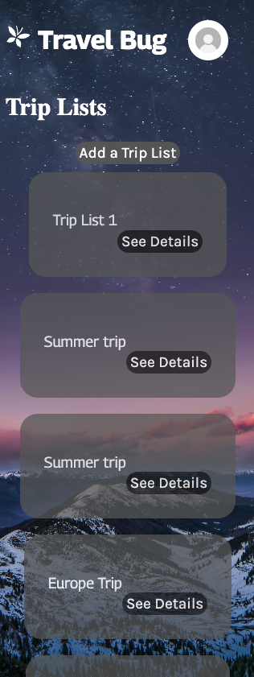
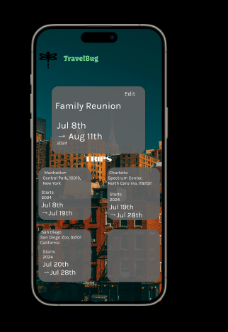
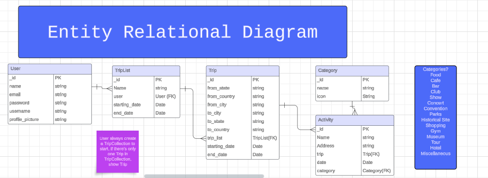
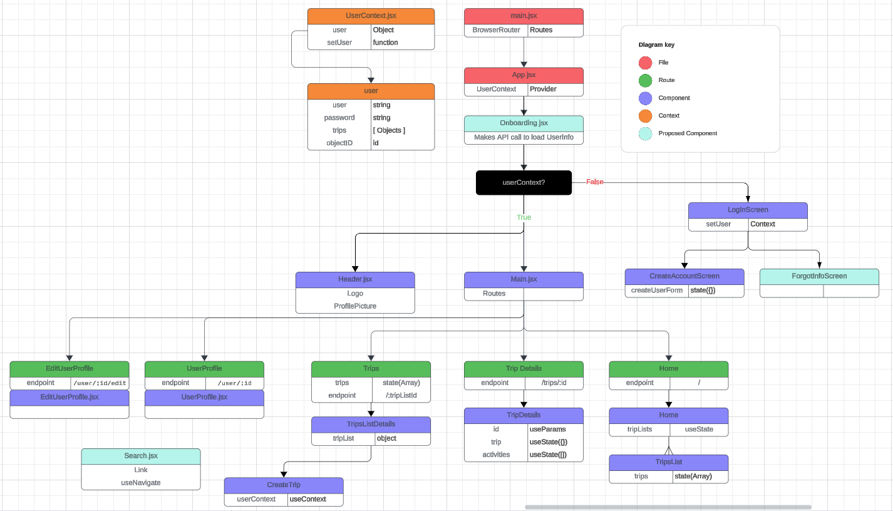

# Travel Bug

Travel Bug offers an intuitive platform for crafting the perfect itinerary tailored to your preferences.

It allows users to save activities like food and drinks, entertainment, parks, and shoppings into each Trip itinerary or group them into a Trip Collection for multiple desa longer vacation.

Effortlessly design detailed itineraries that align with your travel dates, interests, and pace. Add or modify activities and experiences as your plans evolve.





## Wireframes




## Entity Relational Diagram



## Component Hierarchy Diagram



## How to install

```sh
git clone https://github.com/AbeGue02/travel-bug.git
cd travel-bug/travel-bug app
npm i
npm run dev
cd ../server
touch .env
npm i
npm run dev
```

> You will also need to create an `.env` file with a variable called `MONGOBD_CONNECTION_STRING` inside of your server folder and add a connection string to a [MongoDB Atlas](https://www.mongodb.com/atlas/database) database for full functionality

## Sources

### Libraries used:

- [React Icons](https://react-icons.github.io/react-icons/)
- [React Datepicker](https://www.npmjs.com/package/react-datepicker)
- [React Cookies](https://www.npmjs.com/package/react-cookie)
- [Axios](https://axios-http.com/docs/intro)

## Team Members (With Links to Github and LinkedIn)

- Abraham Guerrero (Lead Developer)
    - [Github](https://github.com/AbeGue02) 
    - [LinkedIn](https://www.linkedin.com/in/abrahamdguerrero/)
- Clora Vernon (Back-End Developer)
    - [Github](https://github.com/CV2Tre) 
    - [LinkedIn](http://www.linkedin.com/in/clora-vernon)
- Shaun White (Web Designer)
    - [Github](https://github.com/VenomSymbiotes) 
    - [LinkedIn](https://www.linkedin.com/in/shaunjwhite/)
- Joy Wu (Front-End Developer)
    - [Github](https://github.com/aquaj0y) 
    - [LinkedIn](https://www.linkedin.com/in/joy-s-wu/)
